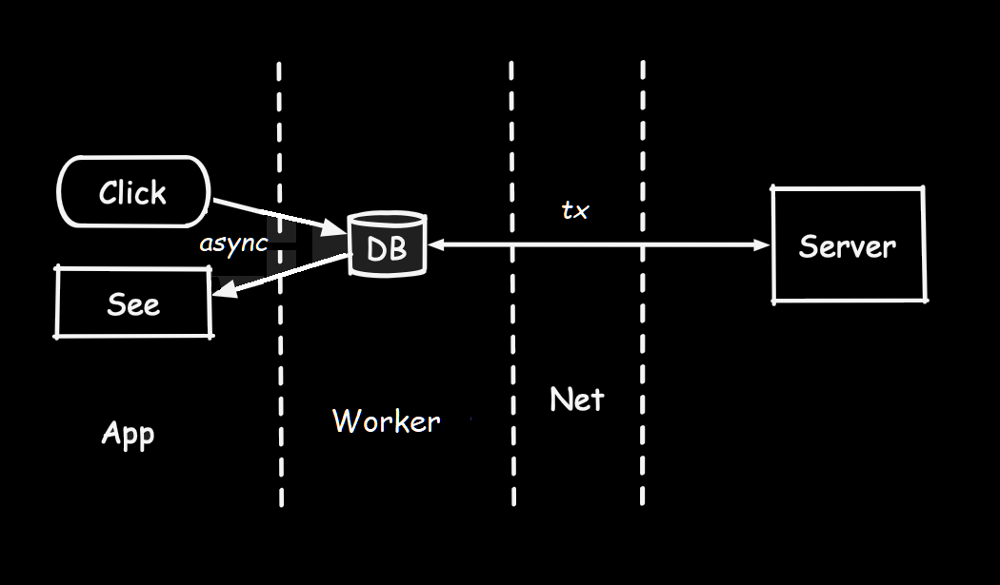

# My TV Channels
## A _LocalFirst_ example application
  - Pure vanilla HTML, CSS, javascript application - no frameworks
  - Local async IDB persistence service
  - Zero dependencies -- no Node, no Deno, no Bun, no Typescript, None, Nada
  - Zero network requirements, statically served from Github Pages

## Run on github:
https://nhrones.github.io/Channels/